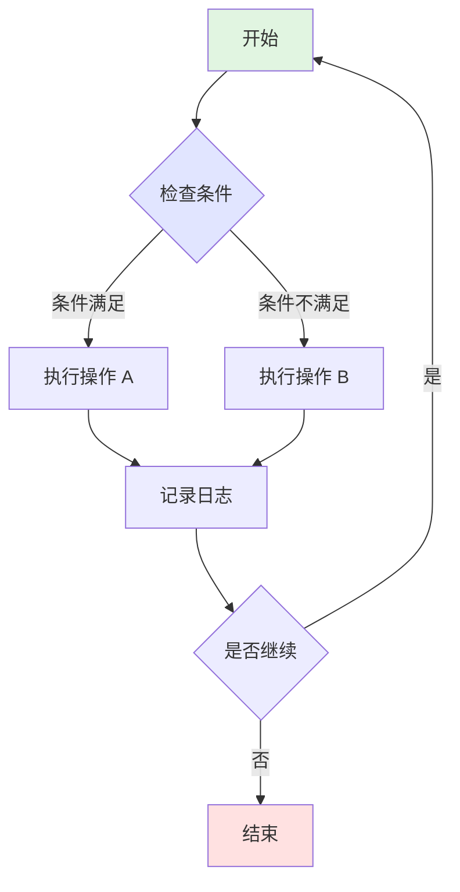
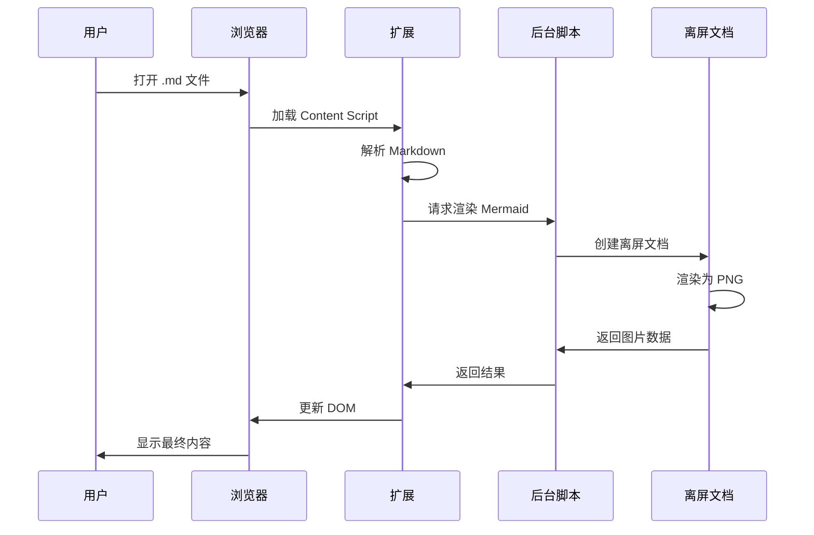
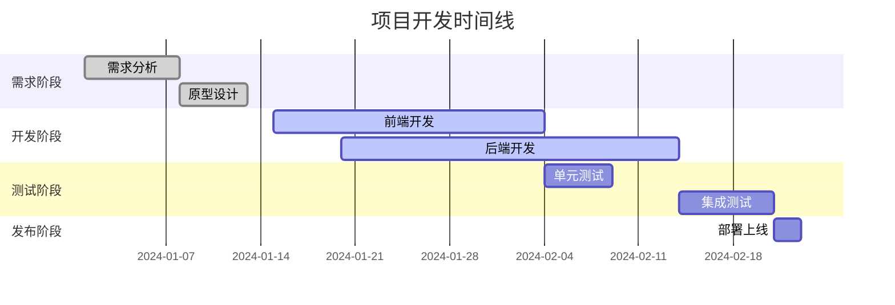
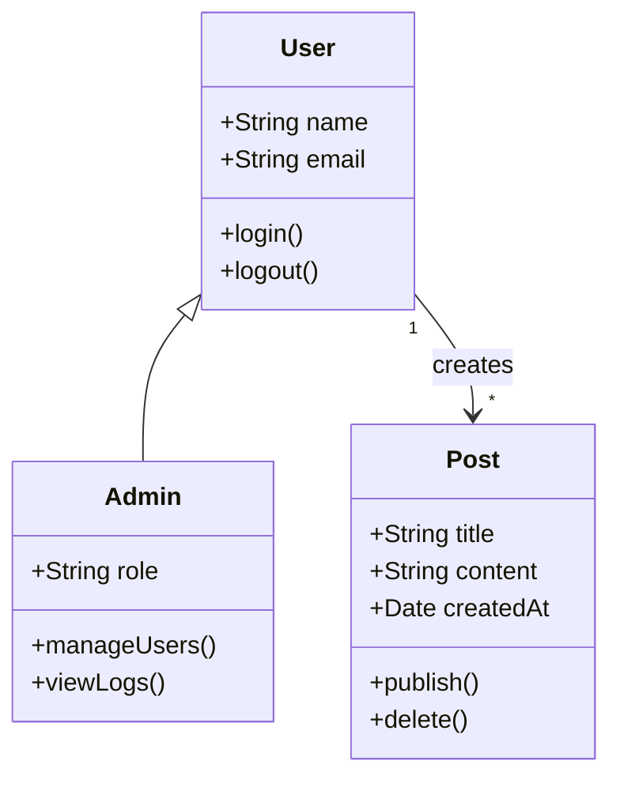
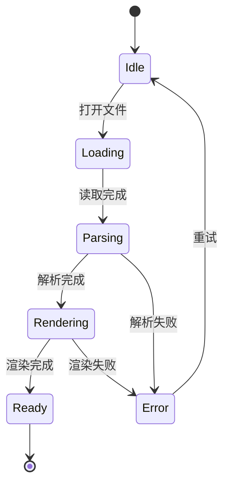
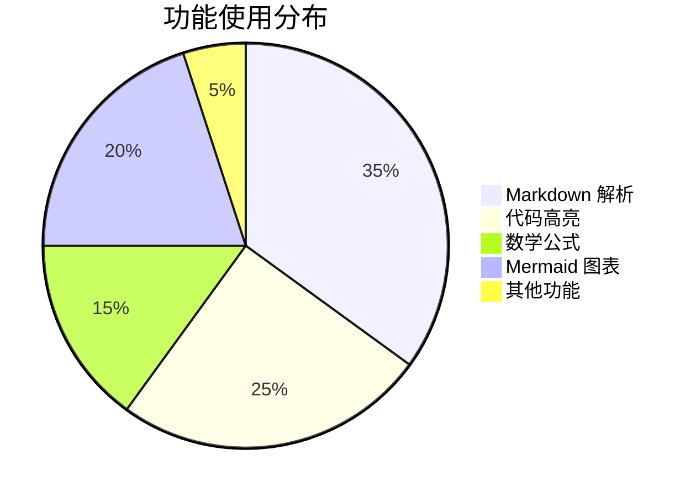

# Markdown Viewer Extension 渲染效果测试

本文档用于全面测试 Chrome 扩展的 Markdown 渲染功能，按照从简单到复杂的顺序组织测试用例。

## 测试内容概览

1. **基础语法** - 标题、段落、文本格式
2. **链接和引用** - 超链接、图片、引用块
3. **列表** - 有序列表、无序列表、嵌套列表
4. **表格** - 基础表格、对齐表格
5. **代码** - 行内代码、代码块、多语言语法高亮
6. **数学公式** - KaTeX 行内和块级公式
7. **图表** - Mermaid 流程图、序列图、甘特图
8. **图片处理** - SVG 转换、Data URL、内联图片
9. **HTML 混合** - 复杂布局和组件
10. **边界测试** - 错误处理、极端情况

---

## 1. 基础 Markdown 语法

### 1.1 标题层级测试

# 一级标题
## 二级标题
### 三级标题
#### 四级标题
##### 五级标题
###### 六级标题

### 1.2 段落和换行

这是第一个段落。段落之间使用空行分隔。

这是第二个段落。测试 remark-breaks 插件的换行功能：
第一行文本
第二行文本（单个换行符应该生效）
第三行文本

**段落内混合格式换行：**
**粗体文本**
普通文本，应该换行
*斜体文本*，继续换行
`代码文本`，继续换行
~~删除线文本~~，最后一行

**长段落换行测试：**
这是一个测试 remark-breaks 插件功能的长段落。
在传统的 Markdown 中，单个换行符不会产生换行效果。
但是添加了 remark-breaks 插件后，每个换行符都会转换为 HTML 的 <br> 标签。
这样就可以实现更自然的换行显示效果。
不再需要在每行末尾添加两个空格来实现换行。

### 1.3 文本格式化

**粗体文本** 使用两个星号或下划线包围

*斜体文本* 使用一个星号或下划线包围

***粗斜体*** 使用三个星号

~~删除线~~ 使用两个波浪号

`行内代码` 使用反引号包围

混合格式测试：**粗体中包含 *斜体* 文字**，~~删除线中包含 **粗体**~~

### 1.4 特殊字符和转义

**标点符号：** ，。！？；：""''（）【】《》

**特殊符号：** @ # $ % ^ & * ( ) [ ] { } | \ ` ~ ! ? < > " '

**Emoji：** 😀 🎉 🚀 ✅ ❌ 🔥 💡 📝 ⭐ 🌟

**Unicode 符号：**
- 数学：∑ ∏ ∫ ∞ ± × ÷ √ ∆ ∇ ∂ ∈ ∉ ⊂ ⊃ ∪ ∩
- 箭头：← → ↑ ↓ ↔ ⇐ ⇒ ⇑ ⇓ ⇔
- 其他：© ® ™ € £ ¥ § ¶ † ‡ • ‰ ‱

**转义字符测试：**
\*不是斜体\* \`不是代码\` \# 不是标题 \[不是链接\](test)

### 1.5 分割线

使用三个或更多的星号、减号或下划线创建分割线：

---

***

___

---

## 2. 链接和引用

### 2.1 超链接

**外部链接：** [GitHub](https://github.com)

**相对路径链接：** [README 文件](../README.md)

**锚点链接：** [跳转到测试总结](#10-边界测试)

**自动链接：** https://github.com 和 user@example.com

### 2.2 图片

**网络图片：**


**本地图片（相对路径）：**


*注：SVG 和 Data URL 图片的详细测试在第 8 节*

### 2.3 引用块

> 这是一个简单的引用块。
> 
> 引用块可以包含多个段落。

> **嵌套引用测试：**
> 
> 外层引用内容
> 
> > 这是嵌套的引用
> > 
> > 可以包含 **格式化** 文本和 `代码`
> 
> 回到外层引用

**引用块内换行测试：**
> 引用的第一行
> 引用的第二行，应该换行
> 引用的第三行

---

## 3. 列表

### 3.1 无序列表

**标准无序列表：**
- 列表项 1
- 列表项 2
- 列表项 3

**星号语法：**
* 列表项 A
* 列表项 B
* 列表项 C

**加号语法：**
+ 列表项 X
+ 列表项 Y
+ 列表项 Z

### 3.2 有序列表

1. 第一项
2. 第二项
3. 第三项
4. 第四项

### 3.3 嵌套列表

**无序嵌套：**
- 顶层项目 1
  - 二级项目 1.1
  - 二级项目 1.2
    - 三级项目 1.2.1
- 顶层项目 2

**有序嵌套：**
1. 第一步
   1. 子步骤 1.1
   2. 子步骤 1.2
2. 第二步
   1. 子步骤 2.1

**混合嵌套：**
1. 有序列表项
   - 无序子项 A
   - 无序子项 B
2. 另一个有序项

**多层级有序列表（测试层级样式）：**
1. 第一层 (1. 2. 3.)
2. 第一层第二项
   1. 第二层 (i. ii. iii.)
   2. 第二层第二项
      1. 第三层 (a. b. c.)
      2. 第三层第二项
         1. 第四层 (a. b. c.)
         2. 第四层第二项
            1. 第五层 (a. b. c.)
   3. 第二层第三项
3. 第一层第三项

### 3.4 列表内换行和段落

**列表项内换行：**
- 列表项标题
  第一行详细说明
  第二行详细说明，应该换行
  第三行详细说明

- 另一个列表项
  包含多行的说明文字
  每行都应该正确换行显示

### 3.5 任务列表（Task List）

**基础任务列表：**
- [x] 已完成的任务
- [ ] 未完成的任务
- [x] 另一个已完成的任务

**嵌套任务列表：**
- [x] 第一项任务
  - [x] 子任务 1
  - [ ] 子任务 2
- [ ] 第二项任务
  - [x] 已完成的子任务
  - [ ] 未完成的子任务

**混合列表：**
1. 有序列表项
   - [x] 任务子项 A
   - [ ] 任务子项 B
2. 另一个有序项
   - [ ] 待办事项

### 3.6 非标准列表符号（测试规范化）

• 使用圆点符号的项目 1
• 使用圆点符号的项目 2

● 使用实心圆点的项目 1
● 使用实心圆点的项目 2

---

## 4. 表格

### 4.1 基础表格

| 列1 | 列2 | 列3 |
|-----|-----|-----|
| 单元格 A1 | 单元格 B1 | 单元格 C1 |
| 单元格 A2 | 单元格 B2 | 单元格 C2 |
| 单元格 A3 | 单元格 B3 | 单元格 C3 |

### 4.2 对齐表格

| 左对齐 | 居中对齐 | 右对齐 |
|:-------|:--------:|-------:|
| Left | Center | Right |
| 文本 | 123 | 456 |
| 长文本测试 | 中文 | 789 |

### 4.3 功能状态表

| 功能 | 状态 | 描述 |
|------|:----:|------|
| Markdown 解析 | ✅ | 完整支持 GFM |
| 代码语法高亮 | ✅ | highlight.js |
| 数学公式渲染 | ✅ | KaTeX 引擎 |
| Mermaid 图表 | ✅ | 转 PNG 输出 |
| SVG 处理 | ✅ | 自动转换 |
| 缓存机制 | ✅ | 双层缓存 |

### 4.4 复杂内容表格

| 语言 | 示例代码 | 说明 |
|------|----------|------|
| JavaScript | `const x = 10;` | 变量声明 |
| Python | `x = 10` | 无需分号 |
| SQL | `SELECT * FROM users;` | 查询语句 |
| Bash | `echo "Hello"` | 输出命令 |

---

## 5. 代码

### 5.1 行内代码

在文本中使用 `console.log()` 或 `print()` 等函数。

关键字测试：`async`、`await`、`function`、`class`、`import`、`export`

### 5.2 代码块

**无语言指定：**
```
This is a plain code block
Without syntax highlighting
Just monospace font
```

**JavaScript / ES6+：**
```javascript
// ES6+ Features
async function fetchUserData(userId) {
    try {
        const response = await fetch(`/api/users/${userId}`);
        const userData = await response.json();
        return { success: true, data: userData };
    } catch (error) {
        console.error('Error fetching user data:', error);
        throw new Error(`Failed to fetch user ${userId}`);
    }
}

// Arrow function and destructuring
const processData = ({ name, age, ...rest }) => ({
    displayName: name.toUpperCase(),
    category: age >= 18 ? 'adult' : 'minor',
    metadata: rest
});

// Class syntax
class User {
    constructor(name) {
        this.name = name;
    }
    
    greet() {
        return `Hello, ${this.name}!`;
    }
}
```

**Python：**
```python
# Type hints and async/await
from typing import List, Dict, Optional
import asyncio

class DataProcessor:
    def __init__(self, config: Dict[str, str]):
        self.config = config
        self.results: List[str] = []
    
    async def process_items(self, items: List[str]) -> Optional[Dict]:
        """Process items and return results"""
        processed = []
        for item in items:
            if item.strip():
                result = await self._process_single_item(item)
                processed.append(result)
        
        return {"total": len(processed), "items": processed}
    
    async def _process_single_item(self, item: str) -> str:
        # Simulate async processing
        await asyncio.sleep(0.1)
        return f"Processed: {item}"

# List comprehension
squares = [x**2 for x in range(10) if x % 2 == 0]
```

**Java：**
```java
// Spring Boot REST Controller
@RestController
@RequestMapping("/api/v1")
public class UserController {
    
    @Autowired
    private UserService userService;
    
    @GetMapping("/users/{id}")
    public ResponseEntity<UserDTO> getUser(@PathVariable Long id) {
        try {
            Optional<User> user = userService.findById(id);
            return user.map(u -> ResponseEntity.ok(UserDTO.fromEntity(u)))
                      .orElse(ResponseEntity.notFound().build());
        } catch (Exception e) {
            logger.error("Failed to get user: {}", e.getMessage());
            return ResponseEntity.status(HttpStatus.INTERNAL_SERVER_ERROR).build();
        }
    }
    
    @PostMapping("/users")
    public ResponseEntity<UserDTO> createUser(@Valid @RequestBody CreateUserRequest request) {
        User newUser = userService.create(request);
        return ResponseEntity.status(HttpStatus.CREATED)
                           .body(UserDTO.fromEntity(newUser));
    }
}
```

**SQL：**
```sql
-- Complex query with CTE
WITH user_stats AS (
    SELECT 
        u.id,
        u.username,
        COUNT(p.id) as post_count,
        AVG(p.rating) as avg_rating
    FROM users u
    LEFT JOIN posts p ON u.id = p.user_id
    WHERE u.created_at >= '2024-01-01'
    GROUP BY u.id, u.username
),
top_users AS (
    SELECT *
    FROM user_stats
    WHERE post_count > 10
    ORDER BY avg_rating DESC
    LIMIT 20
)
SELECT 
    tu.username,
    tu.post_count,
    ROUND(tu.avg_rating, 2) as rating,
    CASE 
        WHEN tu.avg_rating >= 4.5 THEN 'Excellent'
        WHEN tu.avg_rating >= 3.5 THEN 'Good'
        ELSE 'Average'
    END as level
FROM top_users tu
ORDER BY tu.avg_rating DESC;
```

**HTML/CSS：**
```html
<!DOCTYPE html>
<html lang="zh-CN">
<head>
    <meta charset="UTF-8">
    <meta name="viewport" content="width=device-width, initial-scale=1.0">
    <title>Responsive Card Component</title>
    <style>
        .card-container {
            display: grid;
            grid-template-columns: repeat(auto-fit, minmax(300px, 1fr));
            gap: 1.5rem;
            padding: 2rem;
        }
        
        .card {
            background: linear-gradient(135deg, #667eea 0%, #764ba2 100%);
            border-radius: 12px;
            padding: 1.5rem;
            color: white;
            transition: transform 0.3s ease;
        }
        
        .card:hover {
            transform: translateY(-5px);
            box-shadow: 0 10px 20px rgba(0,0,0,0.2);
        }
    </style>
</head>
<body>
    <div class="card-container">
        <div class="card">
            <h3>Feature</h3>
            <p>Multi-language syntax highlighting support</p>
        </div>
    </div>
</body>
</html>
```

**Bash/Shell：**
```bash
#!/bin/bash
# Automated deployment script

set -e  # Exit on error

APP_NAME="markdown-viewer"
VERSION=${1:-"latest"}
DEPLOY_DIR="/opt/apps/$APP_NAME"
LOG_FILE="/var/log/${APP_NAME}-deploy.log"

function log() {
    local message="[$(date +'%Y-%m-%d %H:%M:%S')] $1"
    echo "$message"
    echo "$message" >> "$LOG_FILE"
}

function check_requirements() {
    log "Checking system requirements..."
    
    if ! command -v docker &> /dev/null; then
        log "Error: Docker not installed"
        exit 1
    fi
    
    if ! command -v docker-compose &> /dev/null; then
        log "Error: docker-compose not installed"
        exit 1
    fi
    
    log "Requirements check passed"
}

function deploy() {
    log "Starting deployment of $APP_NAME:$VERSION"
    check_requirements
    
    sudo mkdir -p "$DEPLOY_DIR"
    cd "$DEPLOY_DIR"
    
    log "Stopping existing containers..."
    docker-compose down 2>/dev/null || true
    
    log "Starting new containers..."
    if docker-compose up -d; then
        log "✅ Deployment completed successfully"
    else
        log "❌ Container startup failed"
        exit 1
    fi
}

case "${1:-deploy}" in
    "deploy") deploy ;;
    "help") echo "Usage: $0 [deploy|help]" ;;
    *) echo "Unknown action: $1"; exit 1 ;;
esac
```

**JSON：**
```json
{
  "name": "markdown-viewer-extension",
  "version": "1.0.0",
  "description": "Chrome extension for rendering Markdown files",
  "manifest_version": 3,
  "permissions": [
    "storage",
    "scripting",
    "offscreen"
  ],
  "host_permissions": [
    "file:///*"
  ],
  "content_scripts": [
    {
      "matches": ["file://*/*.md", "file://*/*.markdown"],
      "js": ["content.js"],
      "css": ["styles.css"]
    }
  ]
}
```

**TypeScript：**
```typescript
// Generic types and interfaces
interface User {
    id: number;
    name: string;
    email: string;
    roles: Role[];
}

type Role = 'admin' | 'user' | 'guest';

class UserManager<T extends User> {
    private users: Map<number, T> = new Map();
    
    add(user: T): void {
        this.users.set(user.id, user);
    }
    
    get(id: number): T | undefined {
        return this.users.get(id);
    }
    
    filter(predicate: (user: T) => boolean): T[] {
        return Array.from(this.users.values()).filter(predicate);
    }
}

// Async/await with generics
async function fetchData<T>(url: string): Promise<T> {
    const response = await fetch(url);
    if (!response.ok) {
        throw new Error(`HTTP error! status: ${response.status}`);
    }
    return await response.json();
}
```

---

## 6. 数学公式 (KaTeX)

### 6.1 行内公式

这是行内公式：$E = mc^2$，爱因斯坦质能方程。

常见数学表达式：$\alpha + \beta = \gamma$，$x^2 + y^2 = r^2$

当 $x \to \infty$ 时，函数 $f(x) = \frac{1}{x}$ 趋于 $0$。

### 6.2 块级公式

**二次方程求根公式：**
$$
x = \frac{-b \pm \sqrt{b^2 - 4ac}}{2a}
$$

**求和公式：**
$$
\sum_{i=1}^{n} x_i = x_1 + x_2 + \cdots + x_n
$$

**积分公式：**
$$
\int_{a}^{b} f(x) dx = F(b) - F(a)
$$

**高斯积分：**
$$
\int_{-\infty}^{\infty} e^{-x^2} dx = \sqrt{\pi}
$$

**矩阵表示：**
$$
\begin{bmatrix}
a & b \\
c & d
\end{bmatrix}
\begin{bmatrix}
x \\
y
\end{bmatrix}
=
\begin{bmatrix}
ax + by \\
cx + dy
\end{bmatrix}
$$

**泰勒级数：**
$$
f(x) = f(a) + f'(a)(x-a) + \frac{f''(a)}{2!}(x-a)^2 + \frac{f'''(a)}{3!}(x-a)^3 + \cdots
$$

**欧拉公式：**
$$
e^{ix} = \cos x + i\sin x
$$

---

## 7. Mermaid 图表

### 7.1 流程图



### 7.2 序列图



### 7.3 甘特图



### 7.4 类图



### 7.5 状态图



### 7.6 饼图



### 7.7 扩展整体架构图


<div style="width: 100%; max-width: 1600px; font-family: 'SimSun', 'Times New Roman', Times, serif; background: #fff; box-sizing: border-box; position: relative;">
  <style scoped>
    .ext-arch-container { display: flex; gap: 15px; }
    .ext-wing-left { width: 200px; flex-shrink: 0; }
    .ext-wing-right { width: 200px; flex-shrink: 0; }
    .ext-arch-main { flex: 1; min-width: 0; }
    .ext-arch-title { text-align: center; font-size: 24px; font-weight: bold; color: #1e3a8a; margin-bottom: 20px; }
    .ext-arch-layer { margin: 10px 0; padding: 15px; border-radius: 10px; position: relative; }
    .ext-arch-divider { display: flex; align-items: center; justify-content: center; margin: 8px 0; color: #64748b; font-size: 13px; font-style: italic; }
    .ext-arch-divider-line { flex: 1; height: 1px; background: #cbd5e1; }
    .ext-arch-divider-text { margin: 0 15px; }
    .ext-layer-user { background: linear-gradient(135deg, #fef3c7 0%, #fde68a 100%); border: 2px solid #f59e0b; }
    .ext-layer-extension { background: linear-gradient(135deg, #eff6ff 0%, #dbeafe 100%); border: 2px solid #2563eb; }
    .ext-layer-processing { background: linear-gradient(135deg, #e0f2fe 0%, #bae6fd 100%); border: 2px solid #0284c7; }
    .ext-layer-storage { background: linear-gradient(135deg, #f0fdf4 0%, #dcfce7 100%); border: 2px solid #10b981; }
    .ext-section-header { font-size: 16px; font-weight: bold; color: #334155; margin-bottom: 15px; text-align: center; }
    .ext-user-grid { display: grid; grid-template-columns: repeat(3, 1fr); gap: 15px; }
    .ext-extension-grid { display: grid; grid-template-columns: repeat(5, 1fr); gap: 12px; }
    .ext-processing-grid { display: grid; grid-template-columns: repeat(4, 1fr); gap: 12px; }
    .ext-storage-grid { display: grid; grid-template-columns: repeat(2, 1fr); gap: 15px; }
    .ext-component-box { border-radius: 8px; padding: 12px; text-align: center; box-shadow: 0 2px 4px rgba(0,0,0,0.1); }
    .ext-user-box { background: #fbbf24; border: 1.5px solid #d97706; }
    .ext-extension-box { background: #60a5fa; border: 1.5px solid #2563eb; }
    .ext-processing-box { background: #38bdf8; border: 1.5px solid #0284c7; }
    .ext-storage-box { background: #4ade80; border: 1.5px solid #16a34a; }
    .ext-component-title { font-size: 13px; font-weight: bold; color: #1e3a8a; margin-bottom: 8px; }
    .ext-component-text { font-size: 12px; color: #1e40af; line-height: 1.5; }
    .ext-component-feature { background: rgba(255,255,255,0.7); border-radius: 4px; padding: 4px; margin: 3px 0; font-size: 11px; }
    .ext-wing-panel { background: linear-gradient(135deg, #f3e8ff 0%, #e9d5ff 100%); border: 2px solid #7c3aed; border-radius: 8px; padding: 12px 12px 15px 12px; }
    .ext-wing-panel.external { background: linear-gradient(135deg, #fdf4ff 0%, #fae8ff 100%); border-color: #a855f7; }
    .ext-wing-header { font-size: 16px; font-weight: bold; text-align: center; margin-bottom: 15px; color: #581c87; }
    .ext-wing-header.external { color: #7e22ce; }
    .ext-wing-section { background: #8b5cf6; border: 1.5px solid #7c3aed; border-radius: 6px; padding: 10px; margin: 10px 0; }
    .ext-wing-section.external { background: #a855f7; border-color: #9333ea; }
    .ext-wing-section-title { font-size: 13px; font-weight: bold; color: #f3f4f6; margin-bottom: 8px; text-align: center; }
    .ext-wing-text { font-size: 11px; color: #f3f4f6; line-height: 1.4; text-align: center; }
    .ext-wing-item { background: rgba(255,255,255,0.2); border-radius: 4px; padding: 4px 6px; margin: 3px 0; font-size: 11px; }
  </style>
  <div class="ext-arch-title">Markdown Viewer Extension 整体架构</div>
  <div class="ext-arch-divider"><div class="ext-arch-divider-line"></div></div>
  <div class="ext-arch-container">
    <!-- Left Wing: Core Technologies -->
    <div class="ext-wing-left">
      <div class="ext-wing-panel">
        <div class="ext-wing-header">核心技术栈</div>
        <div class="ext-wing-section">
          <div class="ext-wing-section-title">Markdown处理</div>
          <div class="ext-wing-text">
            <div class="ext-wing-item">unified核心引擎</div>
            <div class="ext-wing-item">remark-parse解析器</div>
            <div class="ext-wing-item">remark-gfm扩展</div>
            <div class="ext-wing-item">remark-math公式</div>
            <div class="ext-wing-item">remark-rehype转换</div>
            <div class="ext-wing-item">unist-util-visit遍历</div>
          </div>
        </div>
        <div class="ext-wing-section">
          <div class="ext-wing-section-title">内容渲染</div>
          <div class="ext-wing-text">
            <div class="ext-wing-item">rehype-highlight语法高亮</div>
            <div class="ext-wing-item">rehype-katex数学渲染</div>
            <div class="ext-wing-item">rehype-stringify输出</div>
            <div class="ext-wing-item">rehype-slug锚点</div>
          </div>
        </div>
        <div class="ext-wing-section">
          <div class="ext-wing-section-title">安全机制</div>
          <div class="ext-wing-text">
            <div class="ext-wing-item">Manifest V3规范</div>
            <div class="ext-wing-item">动态脚本注入</div>
            <div class="ext-wing-item">chrome.scripting API</div>
            <div class="ext-wing-item">权限最小化</div>
          </div>
        </div>
      </div>
    </div>
    <!-- Main Architecture -->
    <div class="ext-arch-main">
      <!-- User Layer -->
      <div class="ext-arch-layer ext-layer-user">
        <div class="ext-section-header">用户交互层</div>
        <div class="ext-user-grid">
          <div class="ext-component-box ext-user-box">
            <div class="ext-component-title">用户</div>
            <div class="ext-component-text">
              <div class="ext-component-feature">文档查看</div>
              <div class="ext-component-feature">快捷键操作</div>
              <div class="ext-component-feature">目录导航</div>
            </div>
          </div>
          <div class="ext-component-box ext-user-box">
            <div class="ext-component-title">Chrome浏览器</div>
            <div class="ext-component-text">
              <div class="ext-component-feature">文件加载</div>
              <div class="ext-component-feature">扩展宿主</div>
              <div class="ext-component-feature">渲染引擎</div>
            </div>
          </div>
          <div class="ext-component-box ext-user-box">
            <div class="ext-component-title">文件系统</div>
            <div class="ext-component-text">
              <div class="ext-component-feature">本地.md文件</div>
              <div class="ext-component-feature">网络资源</div>
              <div class="ext-component-feature">相对路径</div>
            </div>
          </div>
        </div>
      </div>
        <div class="ext-arch-divider">
        <div class="ext-arch-divider-line"></div>
        <div class="ext-arch-divider-text">⬇ 自动检测激活</div>
        <div class="ext-arch-divider-line"></div>
      </div>
        <!-- Extension Layer -->
      <div class="ext-arch-layer ext-layer-extension">
        <div class="ext-section-header">Chrome扩展层</div>
        <div class="ext-extension-grid">
          <div class="ext-component-box ext-extension-box">
            <div class="ext-component-title">Content Detector</div>
            <div class="ext-component-text">
              <div class="ext-component-feature">轻量级检测脚本</div>
              <div class="ext-component-feature">文件扩展名检测</div>
              <div class="ext-component-feature">动态注入触发</div>
              <div class="ext-component-feature">.md/.markdown</div>
            </div>
          </div>
          <div class="ext-component-box ext-extension-box">
            <div class="ext-component-title">Content Script</div>
            <div class="ext-component-text">
              <div class="ext-component-feature">unified处理管道</div>
              <div class="ext-component-feature">DOM重构渲染</div>
              <div class="ext-component-feature">TOC目录生成</div>
              <div class="ext-component-feature">响应式布局</div>
            </div>
          </div>
          <div class="ext-component-box ext-extension-box">
            <div class="ext-component-title">Background Script</div>
            <div class="ext-component-text">
              <div class="ext-component-feature">消息中转代理</div>
              <div class="ext-component-feature">离屏文档管理</div>
              <div class="ext-component-feature">缓存操作代理</div>
              <div class="ext-component-feature">CSS/JS动态注入</div>
            </div>
          </div>
          <div class="ext-component-box ext-extension-box">
            <div class="ext-component-title">Popup UI</div>
            <div class="ext-component-text">
              <div class="ext-component-feature">缓存统计展示</div>
              <div class="ext-component-feature">清理操作界面</div>
              <div class="ext-component-feature">后台代理通信</div>
              <div class="ext-component-feature">状态监控</div>
            </div>
          </div>
          <div class="ext-component-box ext-extension-box">
            <div class="ext-component-title">Offscreen Document</div>
            <div class="ext-component-text">
              <div class="ext-component-feature">Mermaid图表渲染</div>
              <div class="ext-component-feature">SVG→PNG转换</div>
              <div class="ext-component-feature">html2canvas引擎</div>
              <div class="ext-component-feature">DOM_SCRAPING权限</div>
            </div>
          </div>
        </div>
      </div>
      <div class="ext-arch-divider">
        <div class="ext-arch-divider-line"></div>
        <div class="ext-arch-divider-text">⬇ 内容处理管道</div>
        <div class="ext-arch-divider-line"></div>
      </div>
      <!-- Processing Layer -->
      <div class="ext-arch-layer ext-layer-processing">
        <div class="ext-section-header">内容处理层</div>
        <div class="ext-processing-grid">
          <div class="ext-component-box ext-processing-box">
            <div class="ext-component-title">Markdown解析</div>
            <div class="ext-component-text">
              <div class="ext-component-feature">AST语法树</div>
              <div class="ext-component-feature">GFM扩展</div>
              <div class="ext-component-feature">数学公式</div>
              <div class="ext-component-feature">列表规范化</div>
            </div>
          </div>
          <div class="ext-component-box ext-processing-box">
            <div class="ext-component-title">代码语法高亮</div>
            <div class="ext-component-text">
              <div class="ext-component-feature">highlight.js</div>
              <div class="ext-component-feature">多语言支持</div>
              <div class="ext-component-feature">GitHub主题</div>
              <div class="ext-component-feature">自动识别</div>
            </div>
          </div>
          <div class="ext-component-box ext-processing-box">
            <div class="ext-component-title">图表渲染</div>
            <div class="ext-component-text">
              <div class="ext-component-feature">Mermaid→PNG</div>
              <div class="ext-component-feature">SVG→PNG</div>
              <div class="ext-component-feature">HTML→图片</div>
              <div class="ext-component-feature">离屏转换</div>
            </div>
          </div>
          <div class="ext-component-box ext-processing-box">
            <div class="ext-component-title">数学渲染</div>
            <div class="ext-component-text">
              <div class="ext-component-feature">KaTeX引擎</div>
              <div class="ext-component-feature">行内公式</div>
              <div class="ext-component-feature">块级公式</div>
              <div class="ext-component-feature">LaTeX语法</div>
            </div>
          </div>
        </div>
      </div>
      <div class="ext-arch-divider">
        <div class="ext-arch-divider-line"></div>
        <div class="ext-arch-divider-text">⬇ 缓存优化</div>
        <div class="ext-arch-divider-line"></div>
      </div>
      <!-- Storage Layer -->
      <div class="ext-arch-layer ext-layer-storage">
        <div class="ext-section-header">存储缓存层</div>
        <div class="ext-storage-grid">
          <div class="ext-component-box ext-storage-box">
            <div class="ext-component-title">Cache Manager</div>
            <div class="ext-component-text">
              <div class="ext-component-feature">双层缓存架构(L1+L2)</div>
              <div class="ext-component-feature">内存LRU缓存(100项)</div>
              <div class="ext-component-feature">IndexedDB持久化</div>
              <div class="ext-component-feature">SHA-256哈希键</div>
              <div class="ext-component-feature">自动淘汰机制</div>
              <div class="ext-component-feature">后台代理模式</div>
            </div>
          </div>
          <div class="ext-component-box ext-storage-box">
            <div class="ext-component-title">IndexedDB</div>
            <div class="ext-component-text">
              <div class="ext-component-feature">renderCache对象存储</div>
              <div class="ext-component-feature">多索引支持</div>
              <div class="ext-component-feature">时间戳/访问时间索引</div>
              <div class="ext-component-feature">大小/类型索引</div>
              <div class="ext-component-feature">事务安全操作</div>
              <div class="ext-component-feature">版本自动升级</div>
            </div>
          </div>
        </div>
      </div>
    </div>
    <!-- Right Wing: External Dependencies -->
    <div class="ext-wing-right">
      <div class="ext-wing-panel external">
        <div class="ext-wing-header external">外部依赖</div>
        <div class="ext-wing-section external">
          <div class="ext-wing-section-title">语法高亮</div>
          <div class="ext-wing-text">
            <div class="ext-wing-item">highlight.js</div>
            <div class="ext-wing-item">GitHub样式</div>
          </div>
        </div>
        <div class="ext-wing-section external">
          <div class="ext-wing-section-title">数学渲染</div>
          <div class="ext-wing-text">
            <div class="ext-wing-item">KaTeX</div>
            <div class="ext-wing-item">字体资源</div>
          </div>
        </div>
        <div class="ext-wing-section external">
          <div class="ext-wing-section-title">图表生成</div>
          <div class="ext-wing-text">
            <div class="ext-wing-item">Mermaid v11.12.1</div>
            <div class="ext-wing-item">html2canvas v1.4.1</div>
            <div class="ext-wing-item">DOM渲染引擎</div>
          </div>
        </div>
        <div class="ext-wing-section external">
          <div class="ext-wing-section-title">构建工具</div>
          <div class="ext-wing-text">
            <div class="ext-wing-item">esbuild v0.25.11</div>
            <div class="ext-wing-item">FibJS构建脚本</div>
            <div class="ext-wing-item">模块打包优化</div>
          </div>
        </div>
        <div class="ext-wing-section external">
          <div class="ext-wing-section-title">Chrome平台</div>
          <div class="ext-wing-text">
            <div class="ext-wing-item">Extension APIs</div>
            <div class="ext-wing-item">Offscreen API</div>
            <div class="ext-wing-item">Scripting API</div>
            <div class="ext-wing-item">Storage API</div>
          </div>
        </div>
      </div>
    </div>
  </div>

  <div style="margin-top: 20px; padding: 15px; background: #f8fafc; border-radius: 8px; border: 1px solid #e2e8f0;">
    <h4 style="margin: 0 0 10px 0; color: #1e40af; font-size: 16px;">🏗️ 架构特点</h4>
    <div style="display: grid; grid-template-columns: repeat(3, 1fr); gap: 15px; font-size: 13px;">
      <div>
        <strong style="color: #059669;">🔄 模块化设计</strong><br/>
        各组件职责单一，松耦合高内聚
      </div>
      <div>
        <strong style="color: #0284c7;">⚡ 性能优化</strong><br/>
        智能缓存，离屏渲染，异步处理
      </div>
      <div>
        <strong style="color: #7c3aed;">🔒 安全可靠</strong><br/>
        沙箱隔离，权限控制，CSP策略
      </div>
    </div>
  </div>
  <div style="margin-top: 15px; padding: 15px; background: #fefefe; border-radius: 8px; border: 1px solid #e2e8f0;">
    <h4 style="margin: 0 0 10px 0; color: #1e40af; font-size: 16px;">🔄 数据流程详解</h4>
    <div style="font-size: 13px; line-height: 1.6; color: #374151;">
      <ol style="margin: 0; padding-left: 20px;">
        <li><strong>文件检测阶段</strong>：Content Detector轻量级脚本检测.md/.markdown文件扩展名</li>
        <li><strong>动态注入阶段</strong>：通过Background Script的chrome.scripting API动态注入CSS和Content Script</li>
        <li><strong>内容解析阶段</strong>：Content Script运行unified处理管道，调用remark/rehype插件链</li>
        <li><strong>离屏渲染阶段</strong>：Mermaid/SVG复杂内容发送到Offscreen Document进行DOM_SCRAPING渲染</li>
        <li><strong>缓存存储阶段</strong>：通过BackgroundCacheManagerProxy将结果存储到L1内存+L2 IndexedDB双层缓存</li>
        <li><strong>页面重构阶段</strong>：DOM完全重构，生成TOC目录，应用响应式布局和样式</li>
      </ol>
    </div>
  </div>
  <div style="margin-top: 15px; padding: 15px; background: #f0f9ff; border-radius: 8px; border: 1px solid #e0f2fe;">
    <h4 style="margin: 0 0 10px 0; color: #1e40af; font-size: 16px;">⚙️ 关键技术实现</h4>
    <div style="display: grid; grid-template-columns: repeat(2, 1fr); gap: 15px; font-size: 13px;">
      <div>
        <strong style="color: #0284c7;">双层缓存架构</strong><br/>
        • L1内存缓存：Map + LRU(100项)<br/>
        • L2持久缓存：IndexedDB(1000项)<br/>
        • SHA-256内容哈希键<br/>
        • 自动淘汰和统计监控
      </div>
      <div>
        <strong style="color: #059669;">离屏渲染机制</strong><br/>
        • Offscreen API创建沙箱环境<br/>
        • Mermaid图表→PNG转换<br/>
        • html2canvas引擎支持<br/>
        • 错误处理和超时保护
      </div>
      <div>
        <strong style="color: #7c3aed;">消息通信架构</strong><br/>
        • Background Script中转代理<br/>
        • chrome.runtime.sendMessage<br/>
        • 异步回调和错误处理<br/>
        • 30秒超时保护机制
      </div>
      <div>
        <strong style="color: #dc2626;">安全防护体系</strong><br/>
        • Manifest V3规范<br/>
        • 最小权限原则<br/>
        • 动态脚本注入<br/>
        • 内容安全策略(CSP)
      </div>
    </div>
  </div>
</div>

---

## 8. 图片处理

### 8.1 SVG 文件测试

**本地 SVG 文件：**


### 8.2 Data URL SVG 测试

**Base64 编码格式：**


**URL 编码格式：**


**复杂 Data URL SVG：**


### 8.3 内联 SVG 测试

这是文本中的小图标  应该内联显示。

测试多个小图标：  

**混合文本：**
操作成功时显示  图标，点击  展开详情，查看  获取帮助。

---

## 9. HTML 混合内容

### 9.1 简单 HTML 元素

<div style="padding: 15px; background: #f0f9ff; border-left: 4px solid #0284c7; margin: 10px 0;">
  <strong>💡 提示：</strong>这是一个使用 HTML 编写的提示框，测试 HTML 和 Markdown 混合使用。
</div>

<div style="display: flex; gap: 10px; margin: 20px 0;">
  <div style="flex: 1; padding: 15px; background: #dcfce7; border-radius: 8px;">
    <h4 style="margin: 0 0 8px 0; color: #166534;">✅ 成功</h4>
    <p style="margin: 0; font-size: 14px;">操作已成功完成</p>
  </div>
  <div style="flex: 1; padding: 15px; background: #fee2e2; border-radius: 8px;">
    <h4 style="margin: 0 0 8px 0; color: #991b1b;">❌ 错误</h4>
    <p style="margin: 0; font-size: 14px;">发生了一个错误</p>
  </div>
</div>

### 9.2 复杂布局示例

<div style="background: linear-gradient(135deg, #667eea 0%, #764ba2 100%); color: white; padding: 30px; border-radius: 12px; margin: 20px 0;">
  <h3 style="margin: 0 0 15px 0;">扩展功能特性</h3>
  <div style="display: grid; grid-template-columns: repeat(auto-fit, minmax(200px, 1fr)); gap: 15px;">
    <div style="background: rgba(255,255,255,0.1); padding: 15px; border-radius: 8px;">
      <strong>⚡ 高性能</strong><br/>
      双层缓存架构
    </div>
    <div style="background: rgba(255,255,255,0.1); padding: 15px; border-radius: 8px;">
      <strong>🎨 美观</strong><br/>
      现代化UI设计
    </div>
    <div style="background: rgba(255,255,255,0.1); padding: 15px; border-radius: 8px;">
      <strong>🔒 安全</strong><br/>
      Manifest V3
    </div>
  </div>
</div>

### 9.3 数据展示

<table style="border-collapse: collapse; margin: 20px 0;">
  <thead>
    <tr style="background: #f3f4f6;">
      <th style="padding: 12px; text-align: left; border: 1px solid #e5e7eb;">模块</th>
      <th style="padding: 12px; text-align: left; border: 1px solid #e5e7eb;">功能</th>
      <th style="padding: 12px; text-align: center; border: 1px solid #e5e7eb;">状态</th>
    </tr>
  </thead>
  <tbody>
    <tr>
      <td style="padding: 12px; border: 1px solid #e5e7eb;">Content Script</td>
      <td style="padding: 12px; border: 1px solid #e5e7eb;">Markdown 渲染</td>
      <td style="padding: 12px; text-align: center; border: 1px solid #e5e7eb;">✅</td>
    </tr>
    <tr style="background: #f9fafb;">
      <td style="padding: 12px; border: 1px solid #e5e7eb;">Offscreen Document</td>
      <td style="padding: 12px; border: 1px solid #e5e7eb;">图表转换</td>
      <td style="padding: 12px; text-align: center; border: 1px solid #e5e7eb;">✅</td>
    </tr>
    <tr>
      <td style="padding: 12px; border: 1px solid #e5e7eb;">Cache Manager</td>
      <td style="padding: 12px; border: 1px solid #e5e7eb;">性能优化</td>
      <td style="padding: 12px; text-align: center; border: 1px solid #e5e7eb;">✅</td>
    </tr>
  </tbody>
</table>

---

## 10. 边界测试

### 10.1 错误的 Mermaid 语法

```mermaid
invalid syntax here
this should show an error message
```

### 10.2 错误的数学公式

$$
\invalid{command}
\undefined{function}
$$

### 10.3 空代码块

```javascript
```

```python
```

```
```

### 10.4 极端情况

**超长文本行：**
这是一个非常非常非常非常非常非常非常非常非常非常非常非常非常非常非常非常非常非常非常非常非常非常非常非常非常非常非常非常非常非常非常非常非常非常非常非常非常非常非常非常长的文本行，用于测试文本的自动换行和布局处理能力，包含中文字符和English characters以及1234567890数字和!@#$%^&*()特殊符号。

**嵌套格式：**
***~~`这是嵌套的格式化文本，包含粗体、斜体、删除线和代码`~~***

**复杂 Unicode：**
- 数学符号：∑ ∏ ∫ ∞ ± × ÷ √ ∆ ∇ ∂ ∈ ∉ ⊂ ⊃ ∪ ∩ ≈ ≠ ≤ ≥
- 箭头符号：← → ↑ ↓ ↔ ↖ ↗ ↘ ↙ ⇐ ⇒ ⇑ ⇓ ⇔ ⇕
- 货币符号：$ € £ ¥ ₹ ₽ ¢ ₩ ₪ ₱ ฿ ₴
- 其他符号：© ® ™ § ¶ † ‡ • ° ‰ ‱ ℃ ℉ ℓ № ℮

**错误的图片链接：**


**空引用：**
> 

**空列表项：**
- 
- 
  - 

**表格边界：**
| | |
|-|-|
| | |

---

